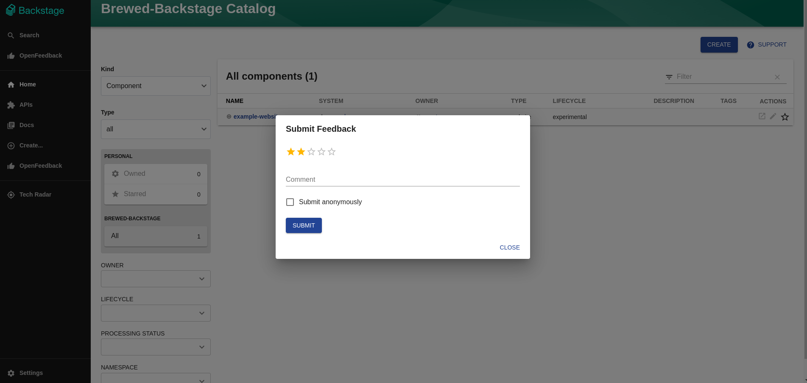
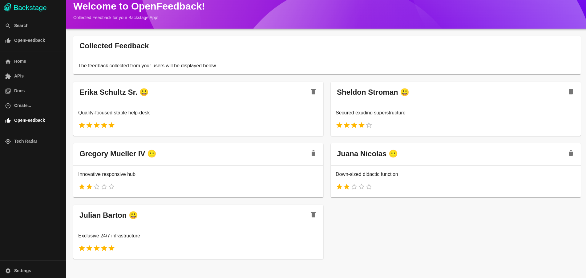

# OpenFeedback Plugin for Backstage

Hello! :wave:

OpenFeedback is a plugin for [Backstage](https://backstage.io/) designed to simplify the process of collecting and managing feedback within your Backstage application, for your Backstage application. It's composed of several components, including a backend, frontend, and common utilities.

Like what you see? Feel free to star this repository and share it with your friends! :star:

## Key Features

- **Feedback Collection**: OpenFeedback provides two interfaces for users to easily submit feedback, helping you gather valuable insights to improve your application.

  - **OpenFeedbackModal**: This component can be added to the sidebar and pops up a dialog box for users to send feedback. It can be easily integrated into your `packages/app/src/components/Root/Root.tsx` file.
  - **OpenFeedbackForm**: This is a form component that can be added to any page (More specifically designed for the [Backstage HomePage](https://backstage.io/docs/getting-started/homepage/#homepage)), providing a flexible way to collect feedback across your application.

- **Feedback Management**: The `OpenFeedbackPage` component provides a comprehensive view of all collected feedback. This page uses the `FeedbackCards` component to display each piece of feedback. Administrators can view all feedback collected from users on this page, making it a central hub for feedback management.

- **Integrated Solution**: OpenFeedback is built to integrate seamlessly with Backstage, allowing you to manage feedback directly within your Backstage application.

## Screenshots

### OpenFeedbackModal

This is the modal that pops up when the user clicks on the feedback button in the sidebar. It allows users to send feedback directly from the Backstage application as their logged in user or anonymously.



### OpenFeedbackPage

This is the page where all the feedback is displayed. It uses card components to display each piece of feedback. Administrators can view all feedback collected from users on this page, making it a central hub for feedback management.



## Components

- `backend`: This component, located in the `plugins/open-feedback-backend` directory, handles data processing and storage, ensuring that feedback data is securely stored and readily accessible.

- `frontend`: This component, located in the `plugins/open-feedback` directory, provides the user interface for collecting and managing feedback. It includes the OpenFeedbackModal and OpenFeedbackForm components for flexible feedback collection.

- `common`: This component, located in the `plugins/open-feedback-common` directory, contains shared types and permissions used by both the backend and frontend.

# Installation

Run the following yarn commands to add all the required packages to your Backstage application:

From the root of your repository you can run the following commands:

```bash
yarn --cwd packages/app add @parsifal-m/backstage-plugin-open-feedback
```

```bash
yarn --cwd packages/backend add @parsifal-m/backstage-plugin-open-feedback-backend
```

## Adding the OpenFeedback Backend to your Backstage Application

To add the OpenFeedback backend to your Backstage application, you need to add the following code to your `packages/backend/src/plugins/index.ts` file:

```typescript
import { createBackend } from '@backstage/backend-defaults';

const backend = createBackend();

// Other plugins
backend.add(import('@parsifal-m/backstage-plugin-open-feedback-backend'));

backend.start();
```

## Adding the OpenFeedback Frontend to your Backstage Application

Firstly you will want to add the `OpenFeedbackPage` component to your `packages/app/src/App.tsx` file under the `routes`. This will add the feedback page to your Backstage application.

In the `OpenFeedbackPage` you will be able to see all the feedback that has been collected from users, and you will also have the option to delete feedback if needed.

```typescript
const routes = (
  <FlatRoutes>
    // Other routes
    <Route path="/open-feedback" element={<OpenFeedbackPage />} />
  </FlatRoutes>
);
```

## Using the OpenFeedbackModal Component

To use the `OpenFeedbackModal` component, you will need to add it to your `packages/app/src/components/Root/Root.tsx` file. This will add the feedback modal to your Backstage application, personally I like to add it under the search button, or above/with the user settings button.

Clicking on it will open a dialog box for users to send feedback.

In the sidebar

```typescript
import { OpenFeedbackModal } from '@parsifal-m/backstage-plugin-open-feedback';

// Inside your Root component
<Sidebar>
  {/* Other SidebarItems */}
  <OpenFeedbackModal />
  {/* Other SidebarItems */}
</Sidebar>;
```

Floating button

```typescript
import { OpenFeedbackModal } from '@parsifal-m/backstage-plugin-open-feedback';

// Anywhere
<OpenFeedbackModal
  floating
  style={{ position: 'fixed', bottom: 20, right: 20 }}
/>;
```

## Using the OpenFeedbackForm Component

I would recommend using the `OpenFeedbackForm` on the [Backstage HomePage](https://backstage.io/docs/getting-started/homepage/#homepage) to collect feedback from users. This component can be added to any page, but it is more specifically designed for the Backstage HomePage.

# Contributing

Contributions are welcome! Feel free to pick up any open issues, or suggest new features by opening an issue!

If you have any questions you can also contact me on mastodon at [@parcifal](https://hachyderm.io/@parcifal).
