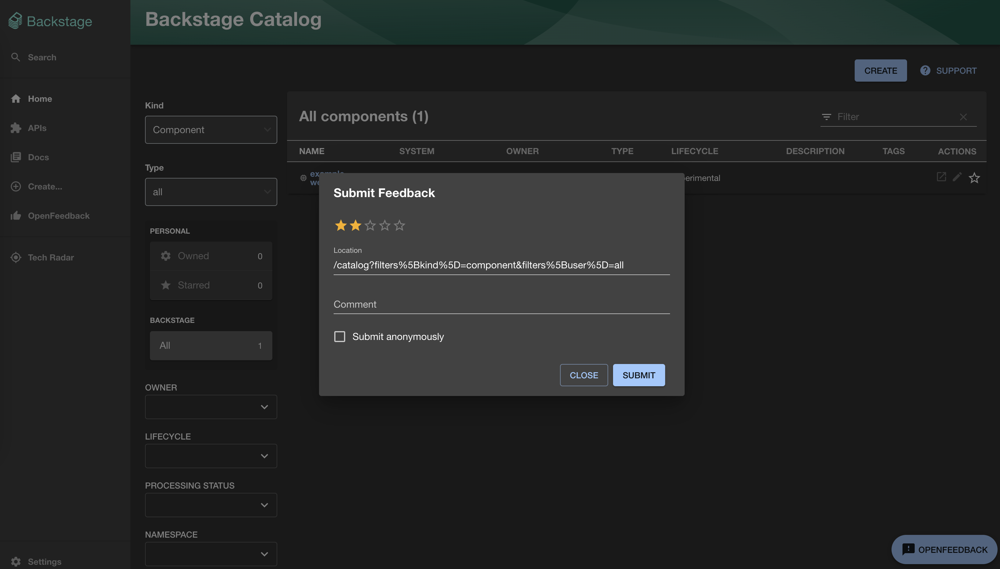
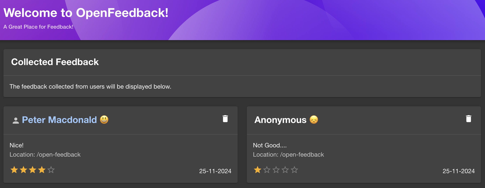

# OpenFeedback Plugin for Backstage

Hello! :wave:

OpenFeedback is a plugin for [Backstage](https://backstage.io/) designed to simplify the process of collecting and managing feedback within your Backstage application, for your Backstage application. It's composed of several components, including a backend, frontend, and common utilities.

Like what you see? Feel free to star this repository and share it with your friends! :star:

## Key Features

- **Feedback Collection**: OpenFeedback provides two interfaces for users to easily submit feedback, helping you gather valuable insights to improve your application.
- **OpenFeedbackModal**: This component can be added to the sidebar and pops up a dialog box for users to send feedback. It can be easily integrated into your `packages/app/src/components/Root/Root.tsx` file.
- **OpenFeedbackForm**: This is a form component that can be added to any page (More specifically designed for the [Backstage HomePage](https://backstage.io/docs/getting-started/homepage/#homepage)), providing a flexible way to collect feedback across your application.
- **Feedback Management**: The feedback page provides a comprehensive view of all collected feedback, displaying each piece as a card. Administrators can view all feedback collected from users on this page, making it a central hub for feedback management.
- **Archive & Restore**: Administrators can archive feedback to keep the active view tidy without losing data. Archived feedback is accessible in a dedicated tab and can be restored to active at any time. Permanent deletion is also available from both tabs.
- **Integrated Solution**: OpenFeedback is built to integrate seamlessly with Backstage, allowing you to manage feedback directly within your Backstage application.

## Screenshots

### OpenFeedbackModal

This is the modal that pops up when the user clicks on the feedback button in the sidebar. It allows users to send feedback directly from the Backstage application as their logged in user or anonymously. It includes a location field to specify the page where the feedback was collected.



### OpenFeedbackPage

This is the page where all the feedback is displayed. It uses card components to display each piece of feedback. Administrators can view all feedback collected from users on this page, making it a central hub for feedback management. It will also display a "location" field to specify the page where the feedback was collected. It also uses the `EntityRefLink` to create a clickable link to the user entity that submitted it, so long as it was not submitted anonymously.

The page has two tabs — **Active** and **Archived** — so administrators can manage feedback without permanently deleting it.



## Feedback Lifecycle

Each piece of feedback can move through the following states:

```text
Submitted → Active → Archived → Permanently Deleted
                  ↑_________|  (restore)
```

- **Archive**: Move feedback from the Active tab to the Archived tab. Use this to tidy up without losing data. Requires the `open.feedback.archive` permission.
- **Restore**: Move feedback back from the Archived tab to Active. Requires the `open.feedback.archive` permission.
- **Delete**: Permanently remove feedback. This action cannot be undone. Requires the `open.feedback.page.delete` permission. Deletion is available from both the Active and Archived tabs.

## Components

- `backend`: This component, located in the `plugins/open-feedback-backend` directory, handles data processing and storage, ensuring that feedback data is securely stored and readily accessible.

- `frontend`: This component, located in the `plugins/open-feedback` directory, provides the user interface for collecting and managing feedback. It includes the OpenFeedbackModal and OpenFeedbackForm components for flexible feedback collection.

- `common`: This component, located in the `plugins/open-feedback-common` directory, contains shared types and permissions used by both the backend and frontend.

## Installation

Run the following yarn commands to add all the required packages to your Backstage application:

From the root of your repository you can run the following commands:

```bash
yarn --cwd packages/app add @parsifal-m/backstage-plugin-open-feedback
```

```bash
yarn --cwd packages/backend add @parsifal-m/backstage-plugin-open-feedback-backend
```

## Adding the OpenFeedback Backend to your Backstage Application

To add the OpenFeedback backend to your Backstage application, you need to add the following code to your `packages/backend/src/plugins/index.ts` file:

```typescript
import { createBackend } from '@backstage/backend-defaults';

const backend = createBackend();

// Other plugins
backend.add(import('@parsifal-m/backstage-plugin-open-feedback-backend'));

backend.start();
```

## Adding the OpenFeedback Frontend to your Backstage Application

> [!WARNING]
> **Breaking change — v1.0.0 and above requires the New Frontend System.**
> The `OpenFeedbackPage` component and `openFeedbackPlugin` named exports have been removed. The plugin now ships as a New Frontend System plugin only and must be used with `@backstage/frontend-defaults` (or any NFS-compatible Backstage app). If you are still on the old frontend system, stay on `v0.x`.

Add the plugin to your app's feature list:

```typescript
// packages/app/src/App.tsx
import { createApp } from '@backstage/frontend-defaults';
import openFeedbackPlugin from '@parsifal-m/backstage-plugin-open-feedback';

const app = createApp({
  features: [
    // ... other plugins
    openFeedbackPlugin,
  ],
});

export default app.createRoot();
```

The feedback page is mounted at `/open-feedback` by default and exposes two tabs:

- **Active** — live feedback visible to administrators. Each card has an archive button and a delete button.
- **Archived** — feedback that has been moved out of the active view. Each card has a restore button to move it back to active, and a permanent delete button.

Archiving requires the `open.feedback.archive` permission. Deletion requires the `open.feedback.page.delete` permission.

### Configuring the Feedback Page

The mount path and page title can be overridden via `app-config.yaml` without any code changes:

```yaml
app:
  extensions:
    - page:open-feedback:
        config:
          path: /my-feedback # optional, defaults to /open-feedback
          title: Team Feedback # optional, defaults to "Open Feedback"
```

## Using the OpenFeedbackModal Component

To use the `OpenFeedbackModal` component, you will need to add it to your `packages/app/src/components/Root/Root.tsx` file. This will add the feedback modal to your Backstage application, personally I like to add it under the search button, or above/with the user settings button.

Clicking on it will open a dialog box for users to send feedback.

In the sidebar

```typescript
import { OpenFeedbackModal } from '@parsifal-m/backstage-plugin-open-feedback';

// Inside your Root component
<Sidebar>
  <SidebarLogo />
  <SidebarGroup label="Search" icon={<SearchIcon />} to="/search">
    <SidebarSearchModal />
    <OpenFeedbackModal
      floating // Setting this to true will make a floating button (FAB), setting it to false will make a sidebar item
      title="Super Feedback!" // Optional, defaults to "Feedback"
      color="primary" // Optional, defaults to "primary"
      icon={FeedbackIcon} // Optional, defaults to the feedback icon
      rating={3} // Optional, the default rating to show in the modal, defaults to 2
      disableAnonymous // Optional, defaults to false, if set to true, the user will not be able to send feedback anonymously
      style={{ position: 'fixed', bottom: 20, right: 20, color: 'primary' }}
    />
  </SidebarGroup>
</Sidebar>;
```

## Permissions

OpenFeedback ships with four permissions that control who can read, delete, archive, and submit feedback. The Delete, Archive, and Restore buttons are already gated inside the plugin — no extra wiring needed for those.

See [docs/permissions.md](./docs/permissions.md) for the full permission reference, backend policy wiring, and how to conditionally hide the nav item.

## Contributing

Contributions are welcome! Feel free to pick up any open issues, or suggest new features by opening an issue!

Some instructions on how to contribute can be found in the [CONTRIBUTING.md](./CONTRIBUTING.md) file.

If you have any questions you can also contact me on mastodon at [@parcifal](https://hachyderm.io/@parcifal).
